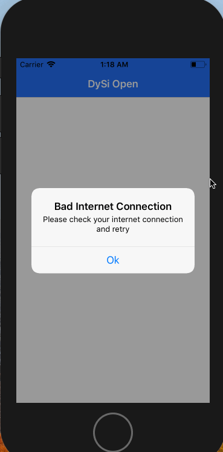

# DySi Open
**DySi Open** uses Dynamic Signal's one public api to get data.

Time Spent: Friday May 4 to Tuesday May 8

**Majority of time taken by:**
- Learning about MVVM framework
- Learning about unit testing in iOS
- Getting started with Texture

## Tasks
- [x] Create a new empty project in Xcode.
- [x] Setup Git for this project and link it to your personal account, make a
  first commit.
- [x] Using a framework of your choosing (native or 3rd party), make a call to
  [Dynamic Signals public api](https://www.dysiopen.com/v1/posts/public). The
  response will be a JSON array of post objects. You can see what these objects
  look like [here](https://dev.voicestorm.com/api/responses/postResponse).
- [x] Using Texture framework, render the following for each post:
    - [x] author (including profile image if it exists)
    - [x] title
    - [x] description
    - [x] creation date
    - [x] post’s image (if exists in the “media” array)
- [x] Clicking on each post should open the post’s "permalink” in a webView.
- [x] Neat UI that should look decent and work on **different screen sizes** +
  **landscape mode**: Thanks to [Texture](https://texturegroup.org)
 
## Bonus (Nice to have features):-
- [x] Implement pull-to-refresh.
- [x] Implement caching mechanism for the server response: Default with
  `Alamofire`
- [x] Implement caching mechanism for images: Defaults with `PINCache`

## Extra features I've added
- [x] User sees an alert when there's a networking error.
- [x] User sees a loading state while waiting for posts to load.
- [x] User sees images being rendered progressively as it gets downloaded.
- [x] User sees Launch Image when they open the app
- [x] User sees a view with a message when the table does not have any posts to
  show. User will not see empty table cells.
- [x] User sees alert when no internet while loading webpage of the permalink
- [x] User sees progress indicator at either below the navigation bar or at the
  bottom of the screen signifying a loading page when the web page of the
  permalink is being loaded
- [x] Not a feature (actually a discouraged action): overrode SSL requirements
  so users can view resources from links that use `HTTP` (since there were
  images that used `http`)

## Unit testing started for
- [x] Utils/ErrorHandler
- [x] Models/DySiPost
- [x] Models/DySiPostAuthor
- [x] ViewControllers/ViewModels/AllPostsTableViewModel
- [x] ViewControllers/ViewModels/PostTableNodeCellViewModel
These above mentioned unit tests are not comprehensive, but are there to show
that the code is testable

## Things that could be improved upon in future (when not in time constraint)
- [ ] Testing for Managers/DySiDataManager
- [ ] Higher test coverage
- [ ] UI testing

## Final App (with full internet access):

## Final App (without internet in beginning and end):

